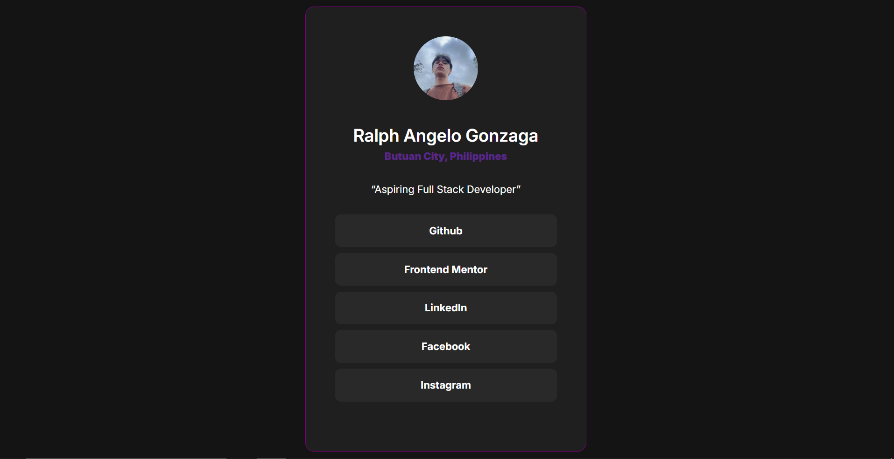

# Frontend Mentor - Social links profile solution

This is a solution to the [Social links profile challenge on Frontend Mentor](https://www.frontendmentor.io/challenges/social-links-profile-UG32l9m6dQ). Frontend Mentor challenges help you improve your coding skills by building realistic projects. 

## Table of contents

- [Overview](#overview)
  - [The challenge](#the-challenge)
  - [Screenshot](#screenshot)
  - [Links](#links)
  - [Built with](#built-with)
  - [What I learned](#what-i-learned)
  - [Continued development](#continued-development)
  - [Author](#author)

## Overview

### The challenge

Users should be able to:

- See hover and focus states for all interactive elements on the page

### Screenshot

### Links

- Solution URL: [https://github.com/codejeroo/social-links-profile]
- Live Site URL: [https://codejeroo.github.io/social-links-profile/]

### Built with

- Semantic HTML5 markup
- CSS custom properties
- Flexbox

### What I learned

I learned how to use and apply ul and li. I also learned how to use hover effects in css.

### Continued development

I will this as an opportunity to further master flexbox and I guess make my pages more dynamic. 

## Author
- Frontend Mentor - [(https://www.frontendmentor.io/profile/codejeroo)]
